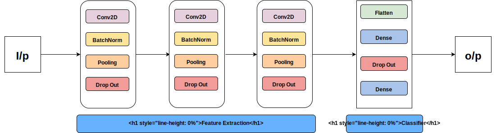
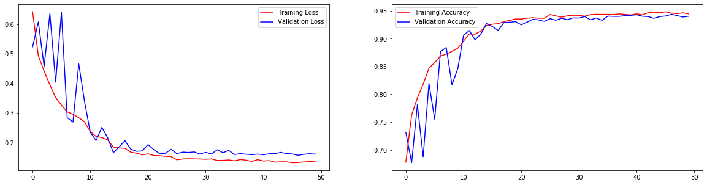
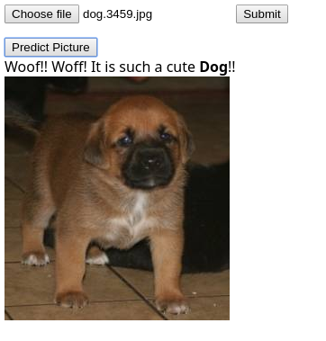

# Cats vs Dogs Classifier

## Overview

This is a simple classification problem where we have a dataset which comprises of cats and dogs images. Our goal is to create a classifier which will learn to differentiate between cats and dogs and will be able to classify any new images as either cat or dog.


## Resources

- Dataset: <a href='https://www.kaggle.com/c/dogs-vs-cats'>Kaggle Dataset</a>
- Framework and libraries: 
  - Keras Model (TF=2.2)
  - Tensorflow.js (TFjs=2.2)
  - Pandas
  - numpy
- IDE/notebook: Jupyterlab
- Live Demo: <a href='https://sb-jr.github.io/projects/dogs_vs_cats_classifier/dogs_vs_cats_classifier.html'>My Github-io repo</a>


## Solution

### Data Preprocessing

Images are loaded using the **keras.preprocessing** module. An **image data generator** is created to produce variations to the input data so that the model can learn all kinds of variations for an input. 

The image data generator does the following tasks:

- Resizes the images into [128,128,3] shape objects
- Normalizes the pixel values so that they lie in the range [0,1]
- creates variations for each image by applying the following transformations:
  - Rotation in range (-15,15) degrees
  - Zooming in and out
  - shifting image by some pixels

This image data generator is then fed to the model as an input which will produce the image with variations and also state the label to which the image belongs.

A batch size of 32 is used by the image data generator to pre-process the data.


### Model




The model comprises of 2 kinds of layers:

1. Feature Extraction
   1. Layer 1:
      1. Conv2D layer: Kernel Params=(shape=(3,3), kernels=32), Activation=ReLU
      2. Batch Normalization Layer
      3. Max Pooling layer: Shape=(2,2)
   2. Layer 2:
      1. Conv2D layer : Kernel Params=(shape=(3,3), kernels=64), Activation=ReLU
      2. Batch Normalization Layer
      3. Max Pooling layer: Shape=(2,2)
   3. Layer 3:
      1. Conv2D layer : Kernel Params=(shape=(3,3), kernels=128), Activation=ReLU
      2. Batch Normalization Layer
      3. Max Pooling layer: Shape=(2,2)
2. Classification Layer:
   1. Flatten Layer
   2. Dense Layer: Nodes=512, Activation=ReLU
   3. Batch Normalization
   4. Output Layer: Nodes =1, Activation=sigmoid

Loss = *binary_crossentropy*

Optimizer = *adam*

Metrics = *accuracy*

I didnt opt for the dropout, even though the creation of dropout has been handled by the model creation method.


```
Model: "sequential_13"
_________________________________________________________________
Layer (type)                 Output Shape              Param #   
=================================================================
conv2d_25 (Conv2D)           (None, 126, 126, 32)      896       
_________________________________________________________________
batch_normalization_25 (Batc (None, 126, 126, 32)      128       
_________________________________________________________________
max_pooling2d_19 (MaxPooling (None, 63, 63, 32)        0         
_________________________________________________________________
conv2d_26 (Conv2D)           (None, 61, 61, 64)        18496     
_________________________________________________________________
batch_normalization_26 (Batc (None, 61, 61, 64)        256       
_________________________________________________________________
max_pooling2d_20 (MaxPooling (None, 30, 30, 64)        0         
_________________________________________________________________
conv2d_27 (Conv2D)           (None, 28, 28, 128)       73856     
_________________________________________________________________
batch_normalization_27 (Batc (None, 28, 28, 128)       512       
_________________________________________________________________
max_pooling2d_21 (MaxPooling (None, 14, 14, 128)       0         
_________________________________________________________________
flatten_6 (Flatten)          (None, 25088)             0         
_________________________________________________________________
dense_12 (Dense)             (None, 512)               12845568  
_________________________________________________________________
batch_normalization_28 (Batc (None, 512)               2048      
_________________________________________________________________
dense_13 (Dense)             (None, 1)                 513       
=================================================================
Total params: 12,942,273
Trainable params: 12,940,801
Non-trainable params: 1,472
```


### Training and Evaluatuion

The dataset was split into 2 subset: Training and Evaluation set.

Respective image data generator was created for handling the set.

2 callbacks we used during the model training:

- __EarlyStopping (Patience = 10)__: This was used to stop the model from further training once accuracy of the model gets saturated.
- __ReduceLROnPlataue (Patience = 2)__: This was used to decrease the learning rate once the model accuracy starts saturating. This is to squeeze out performance as much as possible.

Accuracy on Train set: 94.46%

Accuracy on Validation set: 94.04%




## Live Demo

The model once it was trained and evaluated on the evaluation set, was exported into json format using the TensorflowJs module.

This model was then imported in javascript using the tensorflow-js package script.

The live demo concists of a file uploader, which no submitting is given for preprocessing.

The image is resized into a **[1,128,128,3]** format **Tensor4D object** and normalized so that the input lies in the range [0.1]. The normalization as we know is done so as to stop the neural network activations from sky rocketing or *exploding*.

This **normalized Tensor4D** object is then used for prediction by the model. The model uses an async function called *predict* to provide a tensor object as output. This tensor object has another async function called *data* to provide the probability of each class.

**Note: As we have a predict_classes function in tensorflow python module, the same is not available in the tensorflow-js package. We have to manually calculate the class based on the probability score.**

Once the class has been calculated, the ouput *div* is updated accordingly.




